# States During Regime Change

**Live Dashboard**: [k1monfared.github.io/states_during_regime_change](https://k1monfared.github.io/states_during_regime_change/)

A data-driven framework for measuring, scoring, and comparing post-regime-change trajectories across 40 countries spanning six continents. Combines quantitative data from international organizations (World Bank, ILO, IMF, UNHCR, UCDP, UNDP) with qualitative expert assessments to produce comparable 0--100 scores across six dimensions over time.

---

## Research Question

**How do countries fare after regime change -- and what separates those that recover from those that collapse further?**

This project tracks countries before, during, and after major political transitions to answer:

- Which countries recover faster after regime change, and which spiral downward?
- Do violent transitions produce systematically worse outcomes than peaceful ones?
- Which dimensions of state capacity (political stability, economic performance, international standing, transparency, social welfare, population mobility) recover first, and which lag behind?
- Are there common trajectory patterns that transcend region and culture?

---

## Key Findings and Visualizations

### Full Dataset Overview

A heatmap of composite scores for all 40 countries from 1960 to 2026. Black tick marks indicate regime change events. Green cells represent higher scores (better outcomes); red cells represent lower scores (worse outcomes).

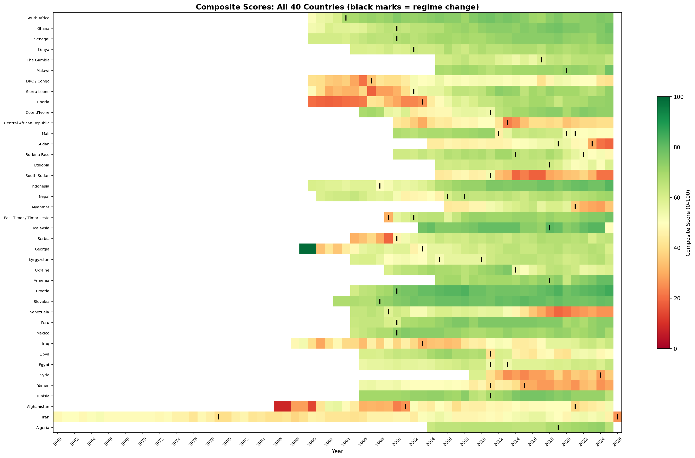

### Composite Trajectories by Region

Six panels showing how composite scores evolve over time within each geographic region. Dashed vertical lines mark each country's regime change year.

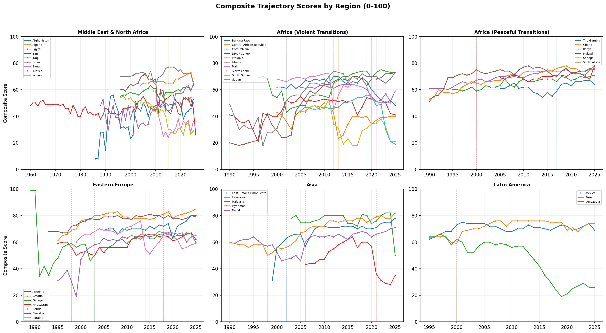

### Violent vs. Peaceful Transitions

Averaging across all countries, violent transitions (red) consistently score lower than peaceful ones (green). The gap persists both before and after the transition year, suggesting that countries that undergo violent transitions were already more fragile. Shaded bands show one standard deviation.

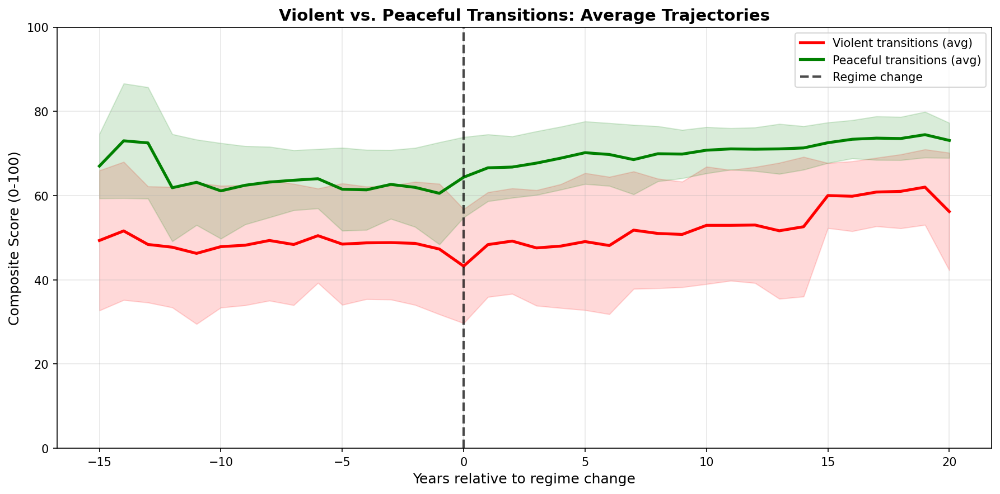

### Dimension Recovery Patterns

Averaging across all countries, international standing tends to score highest, followed by political and economic dimensions. Transparency consistently lags behind all other dimensions and recovers most slowly -- a finding that holds across regions.

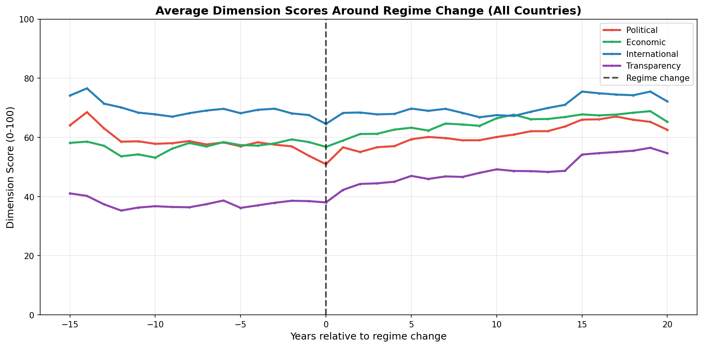

### Case Study: Iraq (All Dimensions)

Iraq's trajectory from 1988 to 2026 shows the devastating impact of the 2003 invasion across all four traditional dimensions, with a long recovery arc. International standing (blue) recovered fastest; transparency (purple) remained lowest for over a decade.

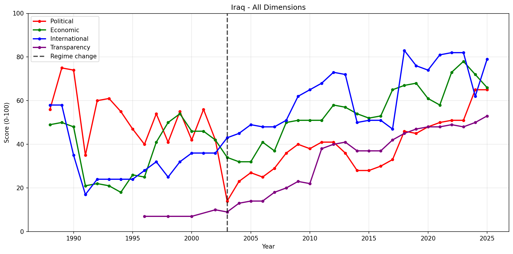

### Iraq: Political Indicators Breakdown

Drilling into Iraq's political dimension reveals that territorial control and political violence drove the post-2003 collapse, while institutional functioning and civil liberties had a more gradual recovery trajectory.

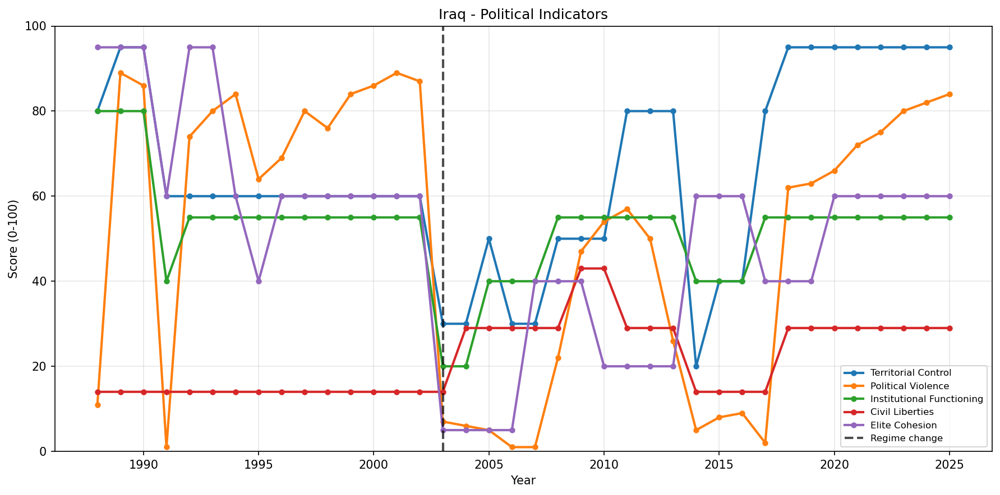

### MENA Region: Composite Score Overlay

Nine MENA countries on common axes. Iran's long arc from 1960 is visible alongside the Arab Spring cluster (2011) affecting Tunisia, Egypt, Libya, Yemen, and Syria.

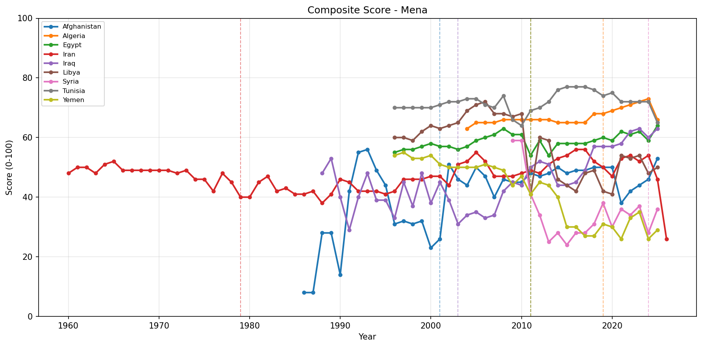

### MENA Region: Aligned to Regime Change

The same MENA countries aligned so that year 0 is each country's primary regime change. This reveals that Tunisia recovered relatively quickly while Libya, Yemen, and Syria experienced prolonged declines.

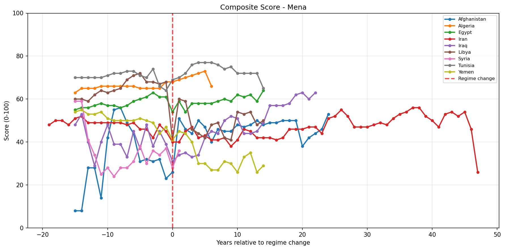

### MENA Heatmap

A compact view of MENA countries showing scores across all years. Afghanistan's dark-red period (1980s--1990s Taliban/Soviet war era) and Iraq's post-invasion dip are clearly visible.

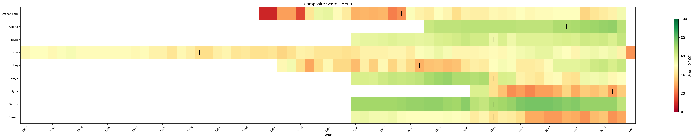

### Arab Spring Countries: Aligned Comparison

Iraq, Libya, Tunisia, and Egypt aligned to their respective regime change years. Tunisia (green) shows the strongest post-transition trajectory among the group.

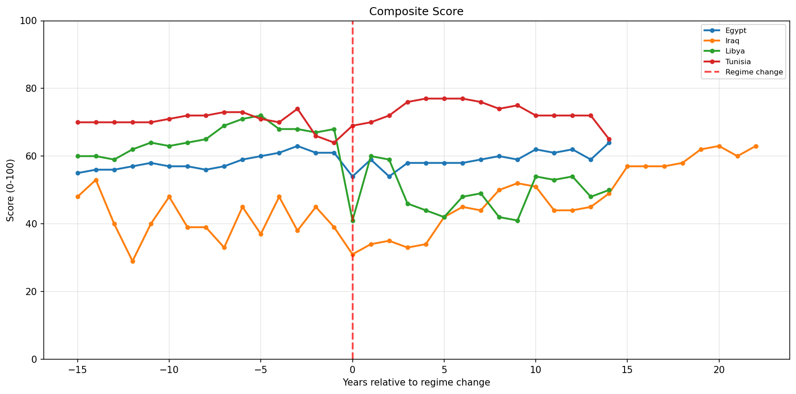

### Peaceful Successful Transitions: Aligned

Seven countries classified as "peaceful successful" transitions -- South Africa, Ghana, Senegal, Croatia, Slovakia, Indonesia, Mexico -- show upward trajectories after regime change, with most reaching composite scores above 70 within 10 years.

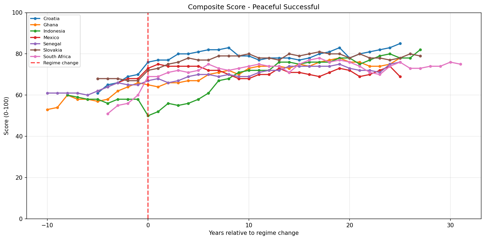

### Africa: Peaceful Transitions

Six African countries that underwent peaceful transitions. South Africa's post-1994 arc leads the group, with Ghana, Senegal, and Kenya showing steady improvement.

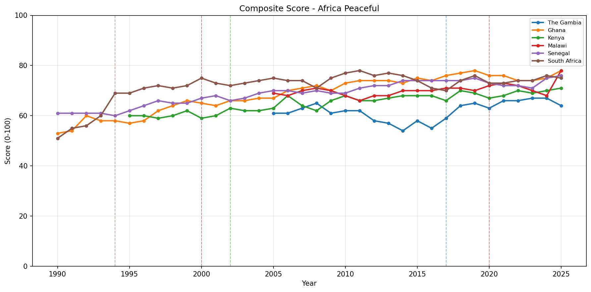

### Eastern Europe

Seven Eastern European countries. Croatia and Slovakia show the strongest upward trajectories following their transitions; Georgia and Serbia show more complex paths with periods of backsliding.

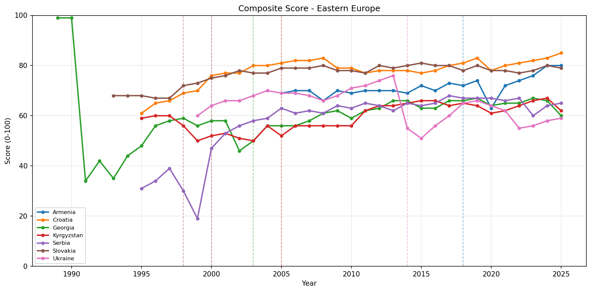

---

## Dataset Summary

| Metric | Value |
|--------|-------|
| Countries covered | 40 |
| Time span | 1960--2026 |
| Dimensions scored | 6 (political, economic, international, transparency, social, population mobility) |
| Unique indicators | 41 |
| Total indicator-year entries | 57,482 |
| Scored entries | 25,250 (43.9%) |
| Quantitative data points | 14,655 |
| Qualitative assessments | 10,595 |
| Canonical data series (CSVs) | 103 |

### Canonical Data Sources

| Source | Series | Description |
|--------|--------|-------------|
| World Bank | 83 | GDP, inflation, trade, health, education, demographics, governance (WGI) |
| ILO | 6 | Employment, unemployment, labor force participation |
| UCDP | 5 | Battle deaths (internal, interstate), one-sided violence, non-state conflict |
| UNHCR | 6 | Refugees (origin/asylum), IDPs, asylum seekers, returnees |
| IMF | 2 | GDP per capita (PPP), government debt to GDP |
| UNDP | 1 | Human Development Index |

---

## Countries Covered (40)

### Middle East and North Africa (9)
Iraq (2003), Libya (2011), Egypt (2011/2013), Syria (2024), Yemen (2011/2015), Tunisia (2011), Afghanistan (2001/2021), Iran (1979/2026), Algeria (2019)

### Africa -- Violent/Unstable Transitions (10)
DRC (1997), Sierra Leone (2002), Liberia (2003), Cote d'Ivoire (2011), Central African Republic (2013), Mali (2012/2020/2021), Sudan (2019/2023), Burkina Faso (2014/2022), Ethiopia (2018), South Sudan (2011)

### Africa -- Peaceful Transitions (6)
South Africa (1994), Ghana (2000), Senegal (2000), Kenya (2002), The Gambia (2017), Malawi (2020)

### Eastern Europe (7)
Serbia (2000), Georgia (2003), Kyrgyzstan (2005/2010), Ukraine (2014), Armenia (2018), Croatia (2000), Slovakia (1998)

### Asia (5)
Indonesia (1998), Nepal (2006/2008), Myanmar (2021), East Timor (1999/2002), Malaysia (2018)

### Latin America (3)
Venezuela (1999), Peru (2000), Mexico (2000)

---

## How It Works

### Scoring Pipeline

```
Raw YAML data (per country/indicator/year)
         |
         v
Scoring rubrics (thresholds + feature maps)
         |
         v
0-100 indicator scores (quantitative or qualitative)
         |
         v
Weighted aggregation --> dimension scores (political, economic, etc.)
         |
         v
Weighted aggregation --> composite score (single number per country-year)
```

1. **Raw data** is stored in YAML files per country/indicator with per-year entries containing optional `quantitative` (numeric value + source) and `qualitative` (free-text assessment + controlled-vocabulary feature tags + sources).
2. **Scoring rubrics** in `data/config/scoring_rubrics.yaml` convert raw data to 0--100 scores using threshold tables (for quantitative values) and feature-to-score mappings (for qualitative tags).
3. **Aggregation** in `data/config/aggregation.yaml` combines indicator scores into dimension scores and then into a composite score. All weights default to equal (1.0) but are configurable.
4. Missing data is handled by `skip_and_renormalize` by default (average only available indicators), but this can be changed to `use_zero`, `exclude_year`, or a fixed fill value.

### The Six Dimensions

| Dimension | Core Indicators | Example Data Sources |
|-----------|----------------|---------------------|
| **Political** | Territorial control, Political violence, Institutional functioning, Civil liberties, Elite cohesion | UCDP, Freedom House, V-Dem, qualitative assessments |
| **Economic** | GDP per capita, Inflation, Unemployment, Trade openness, Fiscal health | World Bank, IMF, ILO |
| **International** | Sanctions, Diplomatic integration, Foreign military presence, FDI, Refugee flows | UNHCR, qualitative assessments |
| **Transparency** | Budget transparency, Press freedom, Statistical transparency, Legal transparency, Extractive transparency | RSF, WJP, Open Budget, EITI |
| **Social** | Life expectancy, Infant mortality, Internet access, Health expenditure, Education expenditure | World Bank, UNDP |
| **Population Mobility** | Net migration, Remittances | World Bank, UNHCR |

---

## Project Structure

```
states_during_regime_change/
|
+-- data/
|   +-- config/                           # Configuration files
|   |   +-- countries.yaml                # 40 countries: metadata, regime change years, categories
|   |   +-- indicators.yaml               # Indicator definitions + valid feature vocabulary
|   |   +-- scoring_rubrics.yaml          # How raw data maps to 0-100 scores
|   |   +-- aggregation.yaml              # How scores combine (weights, functions, missing data)
|   |   +-- fundamental_metrics.yaml      # 114 canonical data series definitions
|   |   +-- source_definitions.yaml       # Source URLs and download configs
|   |
|   +-- raw/                              # Collected data (~800 YAML files)
|   |   +-- <country>/
|   |       +-- <dimension>/
|   |           +-- <indicator>.yaml      # Per-year entries with quant/qual data
|   |
|   +-- canonical/                        # Downloaded canonical datasets (103 CSVs)
|   |   +-- world_bank/                   # 83 World Bank indicator series
|   |   +-- ilo/                          # 6 ILO labor market series
|   |   +-- ucdp/                         # 5 UCDP conflict series
|   |   +-- unhcr/                        # 6 UNHCR displacement series
|   |   +-- imf/                          # 2 IMF macroeconomic series
|   |   +-- undp/                         # 1 UNDP Human Development Index
|   |
|   +-- derived/                          # Generated output (from scoring pipeline)
|   |   +-- scores/<country>.csv          # Per-country score files
|   |   +-- combined.csv                  # All countries combined (4 MB)
|   |
|   +-- scripts/                          # Pipeline tools
|       +-- scaffold.py                   # Creates template YAML files from config
|       +-- generate_scores.py            # Converts raw data to 0-100 scores
|       +-- validate.py                   # Checks data quality and completeness
|       +-- plot_data.py                  # Visualization script (line, overlay, heatmap)
|       +-- download_canonical.py         # Downloads canonical data from APIs
|       +-- build_coverage.py             # Builds coverage statistics
|       +-- progress.py                   # Color-coded data collection progress grid
|       +-- export_web.py                 # Exports data for the web dashboard
|
+-- docs/                                 # GitHub Pages dashboard (HTML/JS/CSS)
+-- plots/                                # Generated plot images
+-- templates/                            # Flask audit UI templates
+-- app.py                                # Flask server for data audit interface
+-- start_dash.sh                         # Launch script for the dashboard
```

---

## Quick Start

### Prerequisites

- Python 3.6+
- PyYAML (`pip install pyyaml`)
- matplotlib (`pip install matplotlib`)
- numpy (`pip install numpy`)
- pandas (`pip install pandas`) -- for some analysis scripts
- Flask (`pip install flask`) -- for the audit UI only

### Generate Scores

```bash
# Generate template files for all countries (safe to re-run)
python3 data/scripts/scaffold.py

# Validate data files
python3 data/scripts/validate.py
python3 data/scripts/validate.py --country iraq

# Generate scores from collected data
python3 data/scripts/generate_scores.py
python3 data/scripts/generate_scores.py --country iraq --verbose --only-scored
```

### Create Visualizations

```bash
# Single country with all dimensions
python3 data/scripts/plot_data.py --countries iraq --show-dimensions --output plots/iraq.png

# Multiple countries overlaid
python3 data/scripts/plot_data.py --countries iraq,libya,tunisia --overlay

# Region comparison aligned to regime change year
python3 data/scripts/plot_data.py --region africa_peaceful --overlay --align-regime-change

# Heatmap view
python3 data/scripts/plot_data.py --region mena --plot-type heatmap --output plots/mena.png

# List available regions and categories
python3 data/scripts/plot_data.py --list-regions
python3 data/scripts/plot_data.py --list-categories
```

### Plot Types

| Type | Flag | Use Case |
|------|------|----------|
| Line (separate) | _(default)_ | Small multiples, one subplot per country |
| Line (overlay) | `--overlay` | Direct comparison on shared axes |
| Line (aligned) | `--overlay --align-regime-change` | Compare recovery/decline patterns relative to t=0 |
| Heatmap | `--plot-type heatmap` | Bird's-eye overview of many countries over many years |

### Check Data Collection Progress

```bash
# Full color-coded grid of all countries x indicators
python3 data/scripts/progress.py

# Summary statistics only
python3 data/scripts/progress.py --summary

# Single country detail
python3 data/scripts/progress.py --country iraq
```

### Run the Audit UI

```bash
# Start Flask audit server (browse to http://localhost:5000/audit)
python3 app.py
```

---

## Raw Data File Format

Each file (e.g., `data/raw/iraq/political/territorial_control.yaml`) contains:

```yaml
indicator: territorial_control
country: iraq
dimension: political

years:
  2003:
    data_status: partial        # complete | partial | missing | unavailable
    quantitative:
      value: null               # numeric value or null
      unit: percent_territory_controlled
      source:
        citation: "World Bank Governance Indicators 2003"
        url: "https://..."
        access_date: "2025-01-20"
      reliability: medium       # high | medium | low
    qualitative:
      assessment: |
        Following the 2003 invasion, central government controlled
        Baghdad and major cities but large portions of the Sunni
        triangle were contested by insurgent groups.
      features:                 # Tags from controlled vocabulary
        - large_portions_contested_30_50pct
        - foreign_occupation
      sources:
        - citation: "ICG Report: Iraq's Transition, June 2003"
          type: think_tank_report
          reliability: high
      confidence: medium        # high | medium | low
      notes: "Immediate post-invasion period; situation fluid"
```

---

## Adding a New Country

1. Add an entry to `data/config/countries.yaml`:
   ```yaml
   new_country:
     display_name: "New Country"
     region: region_name
     category: category_name
     regime_change_years: [2020]
     notes: "Context about the transition"
   ```
   The `time_range` field is optional -- it is auto-calculated as `(earliest_regime_change - 15, current_year)`.

2. Run scaffold: `python3 data/scripts/scaffold.py --country new_country`
3. Collect data for the new country and regenerate scores.

## Changing Scoring Behavior

- **Adjust feature-to-score mappings**: Edit `data/config/scoring_rubrics.yaml`
- **Change aggregation weights**: Edit `data/config/aggregation.yaml` (weight > 1.0 to emphasize, < 1.0 to de-emphasize)
- **Change missing data handling**: In `aggregation.yaml`, set `missing_data_handling` to `skip_and_renormalize` (default), `use_zero`, or `exclude_year`
- After changes, regenerate: `python3 data/scripts/generate_scores.py`

---

## Transition Categories

Countries are classified by the nature of their regime change:

| Category | Countries | Description |
|----------|-----------|-------------|
| Violent/Unstable | Iraq, Libya, Syria, Yemen, Afghanistan, DRC, CAR, South Sudan, Sudan | Regime change through war, invasion, or violent overthrow; ongoing instability |
| Violent then Recovery | Sierra Leone, Liberia | Violent transitions followed by sustained recovery |
| Peaceful Successful | South Africa, Ghana, Senegal, Croatia, Slovakia, Indonesia, Mexico | Peaceful transitions with democratic consolidation |
| Peaceful then Backsliding | Egypt, Tunisia, Serbia, Georgia | Initial democratic opening followed by authoritarian reversion |
| Electoral then Authoritarian | Iran, Venezuela | Electoral mandate eroded into authoritarian rule |
| Recurring Revolutions | Kyrgyzstan | Multiple regime changes in rapid succession |
| Violent Regression | Myanmar | Reversal of democratic gains through military coup |

---

## License

This project is a research and analysis tool. The underlying data comes from publicly available international sources (World Bank, UCDP, UNHCR, ILO, IMF, UNDP, Freedom House, V-Dem, RSF, WJP, and others). Qualitative assessments are based on academic literature, think-tank reports, and news analysis.
